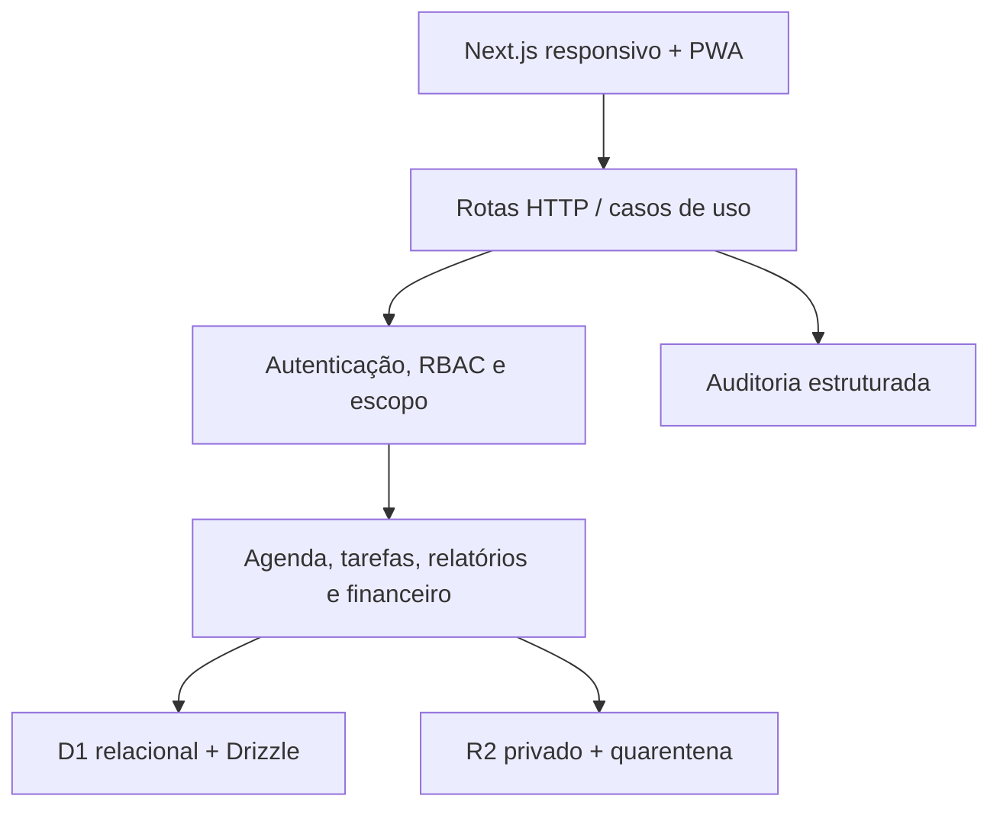

# Arquitetura e decisões

## Visão em camadas

- Interface: Server Components para a entrada autenticada e Client Components para interação.
- Aplicação: `performAction` despacha casos de uso explícitos; não há atualização genérica de objetos nem mass assignment.
- Autorização: `ensureActor`, matriz RBAC e verificações de proprietário/vínculo antes do acesso.
- Domínio: validação Zod, transições de estado e invariantes de negócio.
- Persistência: consultas parametrizadas e `school_id` nas entidades de negócio.
- Arquivos: objetos privados no R2; metadados e autorização no D1.

## Modelo relacional

O arquivo [`db/schema.ts`](../db/schema.ts) possui 59 tabelas normalizadas. Os principais agregados são:

| Domínio | Entidades centrais |
|---|---|
| Tenancy e acesso | escola, unidade, usuário, função, permissão, vínculo função/permissão |
| Acadêmico | aluno, professor, responsável, curso, instrumento, turma, matrícula |
| Agenda | disponibilidade, exceção, série, aula, participante, trava de reserva, presença, crédito de reposição |
| Tarefas | tarefa, destinatário, material, entrega, versão, feedback |
| Evolução | relatório mensal/versão, prática, catálogo, repertório, meta |
| Comunicação | evento/inscrição, aviso/público/leitura, notificação/preferência |
| Recursos | sala/recurso, instrumento patrimonial, empréstimo, manutenção, substituição |
| Financeiro | plano, cobrança, pagamento |
| Governança | consentimento/autorização, arquivo, idempotência, rate limit, auditoria, snapshot de indicador |

IDs expostos são UUIDs/textos não sequenciais. O isolamento futuro entre escolas é reforçado por `school_id` nos índices, filtros e chaves únicas relevantes.

## ADR-001 — PWA em vez de aplicativo nativo inicial

Decisão: entregar uma Progressive Web App instalável em Android, iOS/iPadOS e desktop, mantendo uma única base de código. O manifesto, ícones, navegação responsiva e service worker já existem.

Consequência: instalação e atualização são mais simples. Recursos nativos específicos e publicação em lojas ficam fora desta entrega. O service worker não implementa modo offline de dados privados: somente assets públicos são armazenados.

## ADR-002 — Identidade gerenciada

Decisão: delegar autenticação, sessão e recuperação de conta ao provedor consolidado do ambiente Sites. A aplicação recebe identidade por cabeçalhos confiáveis da plataforma e nunca administra senha.

Consequência: MFA, cookies, rotação e recuperação dependem da política do provedor/tenant; perfis privilegiados devem ter MFA obrigatório antes da produção.

## ADR-003 — Concorrência da agenda por travas discretas

Decisão: cada reserva ocupa slots de cinco minutos por professor, aluno, sala e instrumento, incluindo o intervalo final. Um índice único em `booking_locks` e uma transação D1 fazem apenas um concorrente vencer.

Consequência: conflitos são determinísticos e independem de um teste otimista feito segundos antes. A recorrência inicial é limitada a 12 ocorrências por operação para controlar o tamanho da transação.

## ADR-004 — D1 agora, PostgreSQL como evolução possível

Decisão: usar o banco relacional nativo do ambiente de hospedagem, Cloudflare D1/SQLite, com Drizzle e SQL portátil sempre que possível.

Consequência: o produto já tem persistência real e migrações. Uma migração futura para PostgreSQL exigirá adaptar tipos, sintaxe de datas, concorrência e migrações; não é apenas trocar a URL do banco.

## ADR-005 — Conteúdo privado fora do banco

Decisão: armazenar binários em bucket privado e somente metadados no banco. O download passa novamente pelo backend e não cria URL permanente.

Consequência: antimalware assíncrono é obrigatório para transformar `QUARANTINED` em `CLEAN`; sem o serviço externo, o arquivo fica indisponível por projeto.

## ADR-006 — Indicadores explicáveis, sem ranking

Decisão: métricas mostram período, origem e tamanho da amostra. Professores veem apenas os próprios dados; não há ranking público nem decisão trabalhista automatizada.
